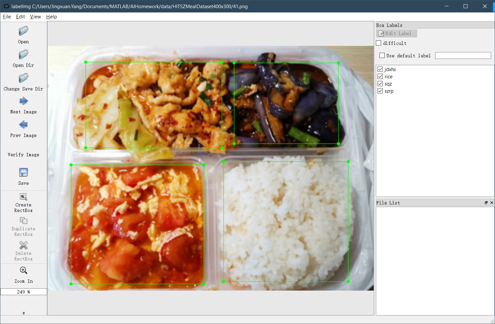
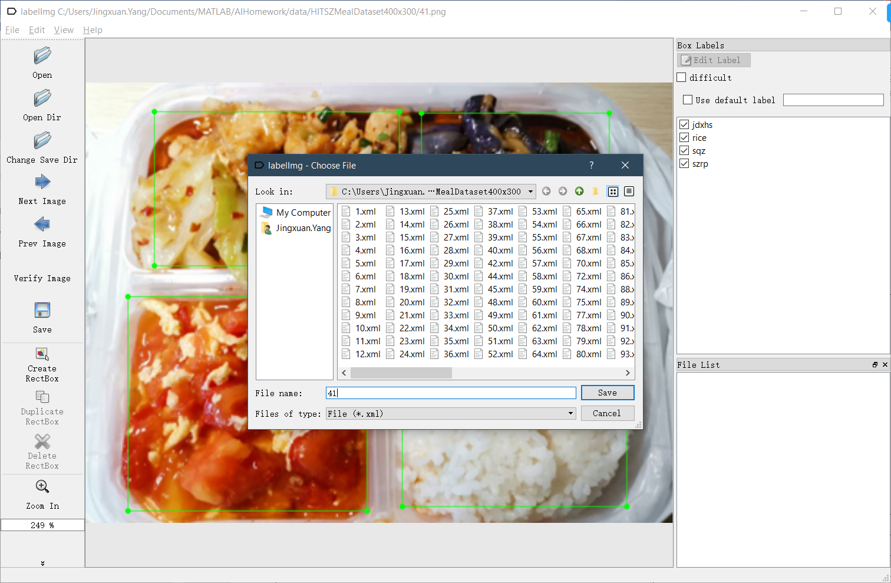
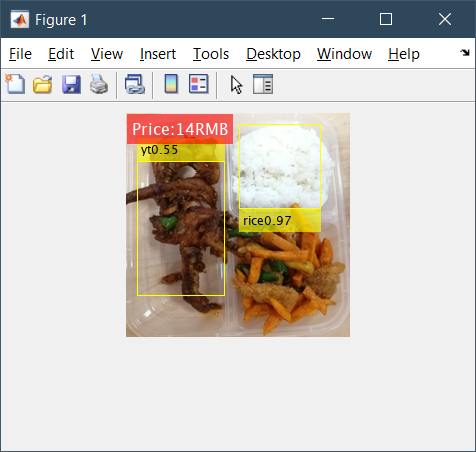
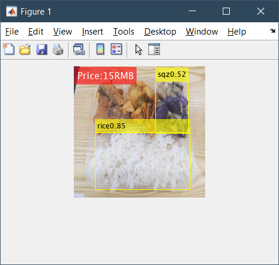
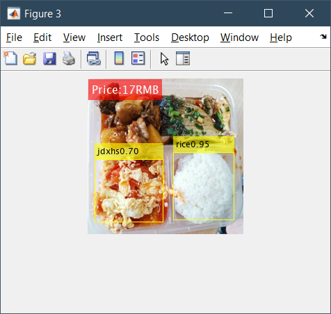
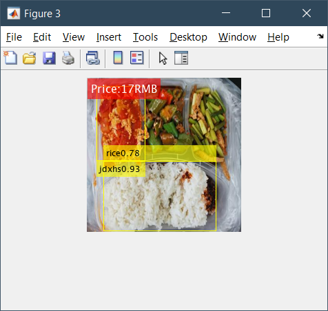
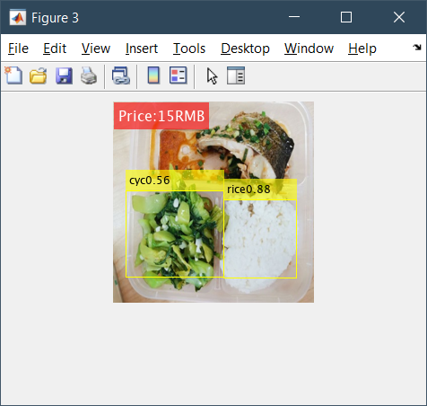

# HITSZ Meal Recognition

## Introduction

**HITSZMealRecognition** is a MATLAB program that recognizes meal and calculates its price automatically using YOLO neural network.

```matlab
|- bin
  |- mealRecognition.m
  |- mealTestDatasetRecognition.m
  |- mealTrainingDatasetRecognition.m
|- data
  |- HITSZMealDataset400x300
    |- *.jpg, 242
    |- *.xml, 242
    |- HITSZMealGroundTruth.mat
    |- HITSZMealLabel.mat
    |- saveGroundTruth.m
|- figures
  |- labelProcess1.png
  |- labelProcess2.png
  |- r1.png
  |- r2.png
  |- r3.png
  |- r4.png
  |- r5.png
|- temp
  |- README.md
|- utils
  |- augmentData.m
  |- imResize.m
  |- preprocessData.m
  |- xmlRead.m
|- README.md
```

## Label Definition

| Variable | Description |
| :- | :- |
| rice | 米饭 |
| jrtd | 鸡肉土豆 |
| dg | 豆干 |
| ymc | 油麦菜 |
| cjd | 炒鸡蛋 |
| nrm | 牛肉面 |
| sqz | 烧茄子 |
| jt | 鸡腿 |
| cqj | 炒青椒 |
| df | 豆腐 |
| jdxhs | 鸡蛋西红柿 |
| st | 蒜苔 |
| bc | 菠菜 |
| wz | 丸子 |
| j2 | 鸡2 |
| gdf | 干豆腐 |
| yr | 鸭肉 |
| cm | 炒面 |
| j1 | 鸡1 |
| csp | 炒笋片 |
| cch | 炒菜花 |
| r2 | 肉2 |
| r1 | 肉1 |
| cyc | 炒油菜 |
| tdnr | 土豆牛肉 |
| xmz | 小米粥 |
| jdhg | 鸡蛋黄瓜 |
| krbf | 烤肉拌饭 |
| szrp | 水煮肉片 |
| r3 | 肉3 |
| cst | 炒笋条 |
| cct | 炒菜头 |
| czch | 炒紫菜花 |
| r4 | 肉4 |
| jdg | 鸡蛋糕 |
| r5 | 肉5 |
| mlt | 麻辣烫 |
| jdjc | 鸡蛋韭菜 |
| cdfp | 炒豆腐片 |
| csh | 炒蒜毫 |
| r6 | 肉6 |
| j3 | 鸡3 |
| jcdp | 韭菜豆片 |
| bcnf | 白菜闹粉 |
| gbjd | 宫保鸡丁 |
| cmg | 炒蘑菇 |
| lm | 拉面 |
| jp | 鸡排 |
| jt2 | 鸡腿2 |
| yt | 鸭腿 |
| hd | 海带 |
| yd | 鱼段 |

## How to Label Images

Use [labelImg](https://github.com/tzutalin/labelImg) software to label images.

Step 1: Label each dish


Step 2: Save xml file


## How to Start Training Process

1. install `Deep Learning Toolbox Model for ResNet-50 Network` toolbox and use MATLAB version 2020a or later
2. add this folder and all its subfolders to matlab searching path
3. run `data/HITSZMealDataset400x300/saveGroundTruth.m` to get ground truth file of the dataset
4. run `bin/mealRecognition.m` to train network and verify results
5. with trained data, you can run `bin/mealTestDatasetRecognition.m` to verify test dataset and `bin/mealTrainingDatasetRecognition.m` to verify training dataset, respectively

## Example

An example training process is shown below, which costs nearly 2 hours.

```matlab
*************************************************************************
Training a YOLO v2 Object Detector for the following object classes:

* rice
* jrtd
* dg
* ymc
* cjd
* nrm
* gbr
* sqz
* jt
* cqj
* df
* jdxhs
* st
* jd
* bc
* wz
* yc
* j2
* gdf
* yr
* cm
* j1
* csp
* cch
* r2
* r1
* cyc
* tdnr
* xmz
* jdhg
* krbf
* szrp
* r3
* cst
* cct
* czch
* r4
* jdg
* r5
* mlt
* jdjc
* cdfp
* csh
* r6
* j3
* jcdp
* bcnf
* gbjd
* cmg
* lm
* jp
* jt2
* yt
* hd
* yd

Training on single GPU.
Initializing input data normalization.
|======================================================================================================================|
|  Epoch  |  Iteration  |  Time Elapsed  |  Mini-batch  |  Validation  |  Mini-batch  |  Validation  |  Base Learning  |
|         |             |   (hh:mm:ss)   |     RMSE     |     RMSE     |     Loss     |     Loss     |      Rate       |
|======================================================================================================================|
|       1 |           1 |       00:00:12 |         6.04 |         2.89 |      36.4648 |       8.3261 |          0.0010 |
|       5 |          50 |       00:02:08 |         1.70 |         1.68 |       2.9017 |       2.8259 |          0.0010 |
|      10 |         100 |       00:04:14 |         1.30 |         1.56 |       1.7015 |       2.4322 |          0.0010 |
|      15 |         150 |       00:06:19 |         1.19 |         1.60 |       1.4222 |       2.5474 |          0.0010 |
|      20 |         200 |       00:08:24 |         1.11 |         1.63 |       1.2372 |       2.6486 |          0.0010 |
|      25 |         250 |       00:10:28 |         1.09 |         1.63 |       1.1945 |       2.6467 |          0.0010 |
|      30 |         300 |       00:12:32 |         1.07 |         1.63 |       1.1550 |       2.6604 |          0.0010 |
|      35 |         350 |       00:14:37 |         0.95 |         1.65 |       0.9035 |       2.7259 |          0.0010 |
|      40 |         400 |       00:16:41 |         0.96 |         1.67 |       0.9282 |       2.7757 |          0.0010 |
|      45 |         450 |       00:18:46 |         1.02 |         1.61 |       1.0330 |       2.6045 |          0.0010 |
|      50 |         500 |       00:20:48 |         0.91 |         1.56 |       0.8285 |       2.4478 |          0.0010 |
|      55 |         550 |       00:22:45 |         0.91 |         1.66 |       0.8258 |       2.7571 |          0.0010 |
|      60 |         600 |       00:24:41 |         0.90 |         1.74 |       0.8162 |       3.0429 |          0.0010 |
|      65 |         650 |       00:26:38 |         0.98 |         1.66 |       0.9628 |       2.7391 |          0.0010 |
|      70 |         700 |       00:28:35 |         0.92 |         1.70 |       0.8434 |       2.8811 |          0.0010 |
|      75 |         750 |       00:30:32 |         0.89 |         1.64 |       0.7837 |       2.6788 |          0.0010 |
|      80 |         800 |       00:32:29 |         0.85 |         1.73 |       0.7217 |       3.0060 |          0.0010 |
|      85 |         850 |       00:34:26 |         0.80 |         1.71 |       0.6447 |       2.9223 |          0.0010 |
|      90 |         900 |       00:36:23 |         0.79 |         1.81 |       0.6216 |       3.2707 |          0.0010 |
|      95 |         950 |       00:38:19 |         0.79 |         1.66 |       0.6245 |       2.7580 |          0.0010 |
|     100 |        1000 |       00:40:16 |         0.80 |         1.71 |       0.6352 |       2.9196 |          0.0010 |
|     105 |        1050 |       00:42:12 |         0.77 |         1.71 |       0.5860 |       2.9217 |          0.0010 |
|     110 |        1100 |       00:44:09 |         0.75 |         1.77 |       0.5618 |       3.1404 |          0.0010 |
|     115 |        1150 |       00:46:06 |         0.75 |         1.79 |       0.5622 |       3.2177 |          0.0010 |
|     120 |        1200 |       00:48:03 |         0.75 |         1.93 |       0.5571 |       3.7390 |          0.0010 |
|     125 |        1250 |       00:49:59 |         0.72 |         1.71 |       0.5192 |       2.9271 |          0.0010 |
|     130 |        1300 |       00:51:56 |         0.70 |         1.81 |       0.4967 |       3.2754 |          0.0010 |
|     135 |        1350 |       00:53:53 |         0.72 |         1.88 |       0.5133 |       3.5208 |          0.0010 |
|     140 |        1400 |       00:55:49 |         0.71 |         1.84 |       0.5047 |       3.3997 |          0.0010 |
|     145 |        1450 |       00:57:46 |         0.69 |         1.81 |       0.4773 |       3.2823 |          0.0010 |
|     150 |        1500 |       00:59:42 |         0.69 |         1.79 |       0.4759 |       3.1913 |          0.0010 |
|     155 |        1550 |       01:01:39 |         0.66 |         1.78 |       0.4292 |       3.1606 |          0.0010 |
|     160 |        1600 |       01:03:36 |         0.63 |         1.74 |       0.4024 |       3.0253 |          0.0010 |
|     165 |        1650 |       01:05:33 |         0.67 |         1.77 |       0.4504 |       3.1407 |          0.0010 |
|     170 |        1700 |       01:07:29 |         0.66 |         1.87 |       0.4394 |       3.5100 |          0.0010 |
|     175 |        1750 |       01:09:26 |         0.59 |         1.72 |       0.3476 |       2.9637 |          0.0010 |
|     180 |        1800 |       01:11:23 |         0.65 |         1.80 |       0.4166 |       3.2458 |          0.0010 |
|     185 |        1850 |       01:13:19 |         0.54 |         1.91 |       0.2931 |       3.6658 |          0.0010 |
|     190 |        1900 |       01:15:16 |         0.81 |         1.80 |       0.6628 |       3.2433 |          0.0010 |
|     195 |        1950 |       01:17:12 |         0.78 |         1.66 |       0.6019 |       2.7468 |          0.0010 |
|     200 |        2000 |       01:19:09 |         0.66 |         1.70 |       0.4379 |       2.8963 |          0.0010 |
|     205 |        2050 |       01:21:06 |         0.58 |         1.69 |       0.3384 |       2.8453 |          0.0010 |
|     210 |        2100 |       01:23:03 |         0.57 |         1.72 |       0.3237 |       2.9709 |          0.0010 |
|     215 |        2150 |       01:24:59 |         0.54 |         1.81 |       0.2898 |       3.2773 |          0.0010 |
|     220 |        2200 |       01:26:56 |         0.52 |         1.78 |       0.2684 |       3.1785 |          0.0010 |
|     225 |        2250 |       01:28:53 |         0.59 |         1.71 |       0.3457 |       2.9146 |          0.0010 |
|     230 |        2300 |       01:30:50 |         0.50 |         1.86 |       0.2476 |       3.4739 |          0.0010 |
|     235 |        2350 |       01:32:48 |         0.48 |         1.86 |       0.2311 |       3.4490 |          0.0010 |
|     240 |        2400 |       01:34:44 |         0.48 |         1.71 |       0.2317 |       2.9211 |          0.0010 |
|     245 |        2450 |       01:36:41 |         0.50 |         1.87 |       0.2543 |       3.5030 |          0.0010 |
|     250 |        2500 |       01:38:38 |         0.55 |         2.04 |       0.3066 |       4.1628 |          0.0010 |
|     255 |        2550 |       01:40:35 |         0.46 |         1.87 |       0.2144 |       3.4843 |          0.0010 |
|     260 |        2600 |       01:42:32 |         0.59 |         1.88 |       0.3496 |       3.5158 |          0.0010 |
|     265 |        2650 |       01:44:29 |         0.52 |         1.78 |       0.2728 |       3.1686 |          0.0010 |
|     270 |        2700 |       01:46:26 |         0.45 |         1.72 |       0.2048 |       2.9435 |          0.0010 |
|     275 |        2750 |       01:48:23 |         0.40 |         1.79 |       0.1591 |       3.2040 |          0.0010 |
|     280 |        2800 |       01:50:19 |         0.45 |         1.75 |       0.1985 |       3.0679 |          0.0010 |
|     285 |        2850 |       01:52:16 |         0.35 |         1.89 |       0.1256 |       3.5809 |          0.0010 |
|     290 |        2900 |       01:54:13 |         0.34 |         1.76 |       0.1189 |       3.0899 |          0.0010 |
|     295 |        2950 |       01:56:10 |         0.39 |         1.80 |       0.1485 |       3.2481 |          0.0010 |
|     300 |        3000 |       01:58:07 |         0.39 |         1.93 |       0.1506 |       3.7139 |          0.0010 |
|======================================================================================================================|
Detector training complete.
*************************************************************************
```

Some recognition results:






